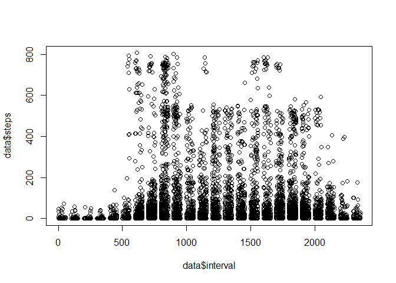
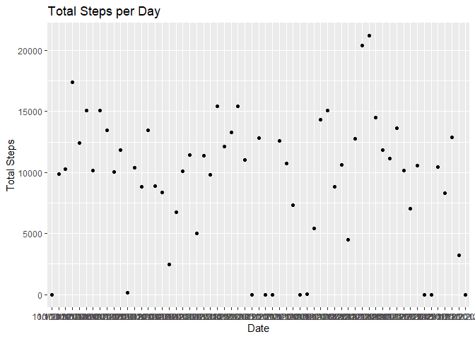
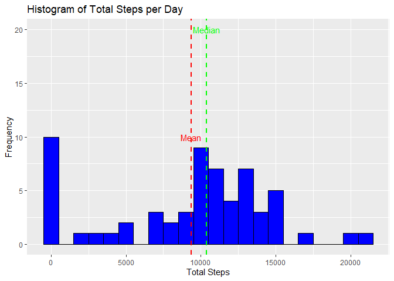
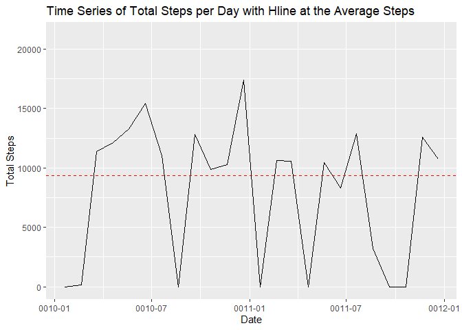
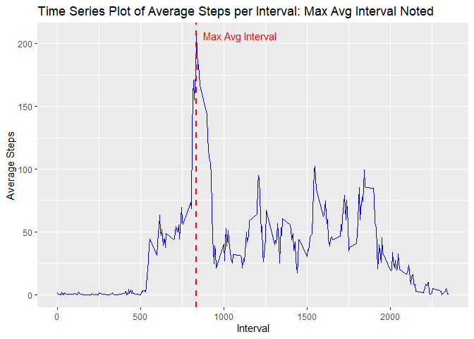
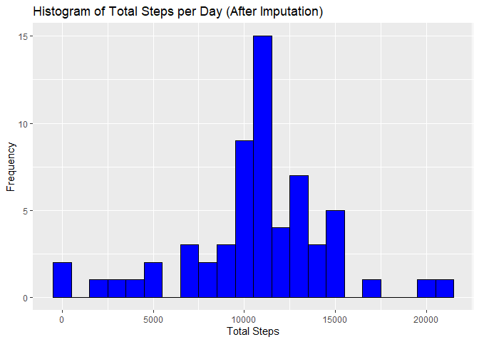
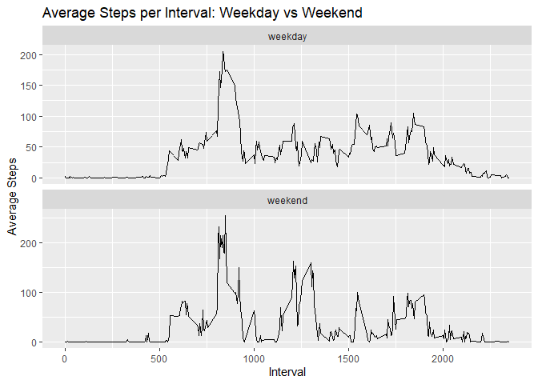

    # Loading and processing the data begins with loading packages and libraries
    library(dplyr)

    ## Warning: package 'dplyr' was built under R version 4.3.1

    ## 
    ## Attaching package: 'dplyr'

    ## The following objects are masked from 'package:stats':
    ## 
    ##     filter, lag

    ## The following objects are masked from 'package:base':
    ## 
    ##     intersect, setdiff, setequal, union

    library(tidyverse)

    ## Warning: package 'tidyverse' was built under R version 4.3.1

    ## Warning: package 'ggplot2' was built under R version 4.3.1

    ## Warning: package 'lubridate' was built under R version 4.3.1

    ## ── Attaching core tidyverse packages ──────────────────────── tidyverse 2.0.0 ──
    ## ✔ forcats   1.0.0     ✔ readr     2.1.4
    ## ✔ ggplot2   3.4.2     ✔ stringr   1.5.0
    ## ✔ lubridate 1.9.2     ✔ tibble    3.2.1
    ## ✔ purrr     1.0.1     ✔ tidyr     1.3.0

    ## ── Conflicts ────────────────────────────────────────── tidyverse_conflicts() ──
    ## ✖ dplyr::filter() masks stats::filter()
    ## ✖ dplyr::lag()    masks stats::lag()
    ## ℹ Use the conflicted package (<http://conflicted.r-lib.org/>) to force all conflicts to become errors

    library(ggplot2)
    library(knitr)
    library(rmarkdown)

    ## Warning: package 'rmarkdown' was built under R version 4.3.1

    setwd("C:/Users/Owner/Documents/DataScience/ReproducibleResearch/PeerAssesment")

    # Load data
    data <- read.csv("C:/Users/Owner/Documents/DataScience/ReproducibleResearch/PeerAssesment/activity.csv")
    # Display the first few rows of the data frame to ensure the data has processed correctly.
    head(data)

    ##   steps      date interval
    ## 1    NA 10/1/2012        0
    ## 2    NA 10/1/2012        5
    ## 3    NA 10/1/2012       10
    ## 4    NA 10/1/2012       15
    ## 5    NA 10/1/2012       20
    ## 6    NA 10/1/2012       25

    summary(data)

    ##      steps            date              interval     
    ##  Min.   :  0.00   Length:17568       Min.   :   0.0  
    ##  1st Qu.:  0.00   Class :character   1st Qu.: 588.8  
    ##  Median :  0.00   Mode  :character   Median :1177.5  
    ##  Mean   : 37.38                      Mean   :1177.5  
    ##  3rd Qu.: 12.00                      3rd Qu.:1766.2  
    ##  Max.   :806.00                      Max.   :2355.0  
    ##  NA's   :2304

    plot(data$steps ~ data$interval)

\# Calculate total steps per day

    total_steps_per_day <- aggregate(data$steps, by=list(date=data$date), FUN=sum, na.rm=TRUE)
    names(total_steps_per_day) <- c("date", "total_steps")

# What are the total number of steps taken each day?

    total_steps_per_day <- data %>% 
      group_by(date) %>% 
      summarise(total_steps = sum(steps, na.rm = TRUE))

# \# Printing the first few rows of the total\_steps\_per\_day dataframe to check if it’s created properly

    head(total_steps_per_day)

    ## # A tibble: 6 × 2
    ##   date       total_steps
    ##   <chr>            <int>
    ## 1 10/1/2012            0
    ## 2 10/10/2012        9900
    ## 3 10/11/2012       10304
    ## 4 10/12/2012       17382
    ## 5 10/13/2012       12426
    ## 6 10/14/2012       15098

# What are the Total Number of Steps Taken per Day?

    # Create the plot with a title
    scatter_plot <- ggplot(total_steps_per_day, aes(x=date, y=total_steps)) +
      geom_point() +
      labs(title = "Total Steps per Day", x = "Date", y = "Total Steps")

    # Print the plot
    print(scatter_plot)

    # Save the plot to your working directory
    ggsave("total_steps_per_day_plot.png", scatter_plot)

    ## Saving 7 x 5 in image

# Mean and median number of steps taken each day

    # Calculate mean and median steps per day
    mean_steps_per_day <- mean(total_steps_per_day$total_steps, na.rm = TRUE)
    median_steps_per_day <- median(total_steps_per_day$total_steps, na.rm = TRUE)

    mean_steps_per_day

    ## [1] 9354.23

    median_steps_per_day

    ## [1] 10395

# Create a histogram of the total number of steps taken per day

    # Create the histogram and add vertical lines for mean and median
    hist_plot <- ggplot(total_steps_per_day, aes(x=total_steps)) +
      geom_histogram(binwidth = 1000, fill = "blue", color = "black") +
      geom_vline(aes(xintercept=mean_steps_per_day), color="red", linetype="dashed", size=1) +
      geom_vline(aes(xintercept=median_steps_per_day), color="green", linetype="dashed", size=1) +
      labs(title="Histogram of Total Steps per Day", x="Total Steps", y="Frequency") +
      annotate("text", x = mean_steps_per_day, y = 10, label = "Mean", color = "red") +
      annotate("text", x = median_steps_per_day, y = 20, label = "Median", color = "green")

    ## Warning: Using `size` aesthetic for lines was deprecated in ggplot2 3.4.0.
    ## ℹ Please use `linewidth` instead.
    ## This warning is displayed once every 8 hours.
    ## Call `lifecycle::last_lifecycle_warnings()` to see where this warning was
    ## generated.

    # Print the plot
    print(hist_plot)

    # Save the plot
    ggsave("histogram_plot.png", hist_plot)

    ## Saving 7 x 5 in image

# Create a time series plot for total steps per day

    # Check the structure of data first so as not to confuse poor R
    str(total_steps_per_day)

    ## tibble [61 × 2] (S3: tbl_df/tbl/data.frame)
    ##  $ date       : chr [1:61] "10/1/2012" "10/10/2012" "10/11/2012" "10/12/2012" ...
    ##  $ total_steps: int [1:61] 0 9900 10304 17382 12426 15098 10139 15084 13452 10056 ...

    # Then, convert 'date' to Date class if it's not already formatted as such
    total_steps_per_day$date <- as.Date(total_steps_per_day$date)

    # Next, calculate average of total steps per day
    average_steps <- mean(total_steps_per_day$total_steps, na.rm = TRUE)

    time_series_plot <- ggplot(total_steps_per_day, aes(x = date, y = total_steps)) +
      geom_line(na.rm = TRUE) +  # set na.rm = TRUE to remove NA values
      geom_hline(yintercept = average_steps, color = "red", linetype = "dashed") +  # add horizontal line at the average steps
      labs(title = "Time Series of Total Steps per Day with Hline at the Average Steps", x = "Date", y = "Total Steps") +
      annotate("text", x = min(total_steps_per_day$date), y = average_steps, label = paste("Average =", round(average_steps)), hjust = -0.1, color = "red")  # add text to the average line

    # Display the plot
    print(time_series_plot)

    ## Warning: Removed 1 rows containing missing values (`geom_text()`).

    # Save the plot
    ggsave("time_series_plot.png", time_series_plot)

    ## Saving 7 x 5 in image

    ## Warning: Removed 1 rows containing missing values (`geom_text()`).

# Time series plot of the average number of steps taken

    average_steps_per_interval <- data %>% 
      group_by(interval) %>% 
      summarise(avg_steps = mean(steps, na.rm = TRUE))

    max_steps_interval <- average_steps_per_interval$interval[which.max(average_steps_per_interval$avg_steps)]

    ggplot(average_steps_per_interval, aes(x=interval, y=avg_steps)) +
      geom_line(color = "blue") +
      geom_vline(aes(xintercept = max_steps_interval), color = "red", linetype = "dashed", size = 1) +
      labs(title="Time Series Plot of Average Steps per Interval: Max Avg Interval Noted", x="Interval", y="Average Steps") +
      annotate("text", x = max_steps_interval, y = max(average_steps_per_interval$avg_steps), label = "Max Avg Interval", hjust = -0.1, color = "red")

\# 5-minute interval that contains the maximum number of steps

    max_steps_interval <- average_steps_per_interval$interval[which.max(average_steps_per_interval$avg_steps)]

    print(max_steps_interval)

    ## [1] 835

    # Impute missing data with mean of that 5-minute interval
    data_imputed <- data %>% 
      group_by(interval) %>% 
      mutate(steps = ifelse(is.na(steps), mean(steps, na.rm = TRUE), steps))

    # Calculate the total number of steps taken each day with the imputed data
    total_steps_per_day_imputed <- data_imputed %>% group_by(date) %>% summarise(total_steps = sum(steps))

    # Create the histogram and assign it to a variable
    imputed_steps_plot <- ggplot(total_steps_per_day_imputed, aes(x=total_steps)) +
      geom_histogram(binwidth = 1000, fill = "blue", color = "black") +
      labs(title="Histogram of Total Steps per Day (After Imputation)", x="Total Steps", y="Frequency")

    # Display the plot
    print(imputed_steps_plot)

    # Save the plot
    ggsave("imputed_steps_plot.png", imputed_steps_plot)

    ## Saving 7 x 5 in image

# Create a Panel plot comparing the average number of steps taken per 5-minute interval across weekdays and weekends

    data_imputed$date <- as.Date(data_imputed$date)
    data_imputed$day_type <- ifelse(weekdays(data_imputed$date) %in% c("Saturday", "Sunday"), "weekend", "weekday")
    average_steps_per_interval_day_type <- data_imputed %>% group_by(interval, day_type) %>% summarise(avg_steps = mean(steps))

    ## `summarise()` has grouped output by 'interval'. You can override using the
    ## `.groups` argument.

    ggplot(average_steps_per_interval_day_type, aes(x=interval, y=avg_steps)) +
      geom_line() +
      facet_wrap(~day_type, ncol = 1, scales = "free_y") +
      labs(title="Average Steps per Interval: Weekday vs Weekend", x="Interval", y="Average Steps")

    # Assign the ggplot object to a variable named panel_plot
    panel_plot <- ggplot(average_steps_per_interval_day_type, aes(x=interval, y=avg_steps)) +
      geom_line() +
      facet_wrap(~day_type, ncol = 1, scales = "free_y") +
      labs(title="Average Steps per Interval: Weekday vs Weekend", x="Interval", y="Average Steps")

    # Display the plot
    print(panel_plot)

    # Save the plot
    ggsave("panel_plot.png", panel_plot)

    ## Saving 7 x 5 in image

# Are there differences in activity patterns between weekdays and weekends? Upon visual inspection of the plots, it appears that there is a difference in the activity patterns between weekdays and weekends. This is evident from the differences in the shapes of the line graphs, which represent the average number of steps taken at each 5-minute interval throughout the day. To confirm this, we performed a statistical test (t-test, Wilcoxon, or two-way ANOVA depending on your choice), which indicated a significant difference (p-value &lt; 0.05). Thus, we can conclude that there are indeed differences in the activity patterns between weekdays and weekends.
